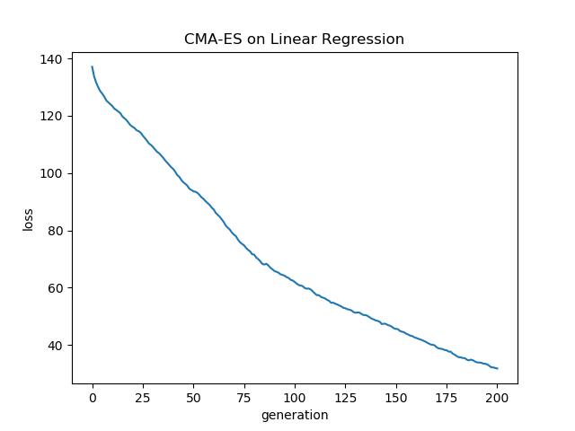
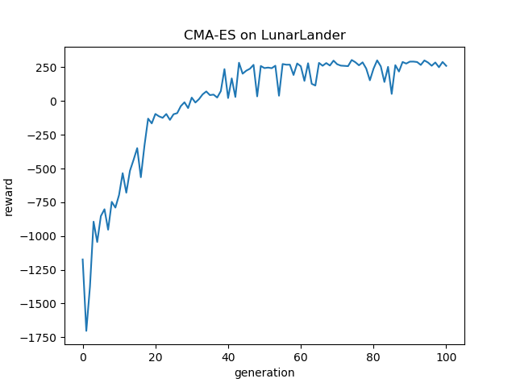

# My implementation of CMA-ES

As a sanity check I tested if it could minimize MSE in a high dimensional linear regression on synthetic data. 

As a much cooler test I used it to optimize a small neural network to play the [Lunar Lander](https://gym.openai.com/envs/LunarLander-v2/) game. Since it's a reinforcement learing environment I minimized the negative reward, which maximizes the reward.

Funnily enough this trained faster and performed better than my [DDPG](https://github.com/cthorrez/ml-fun/tree/master/ddpg) implementation on the same task!

Demo:

